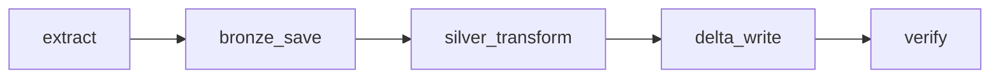
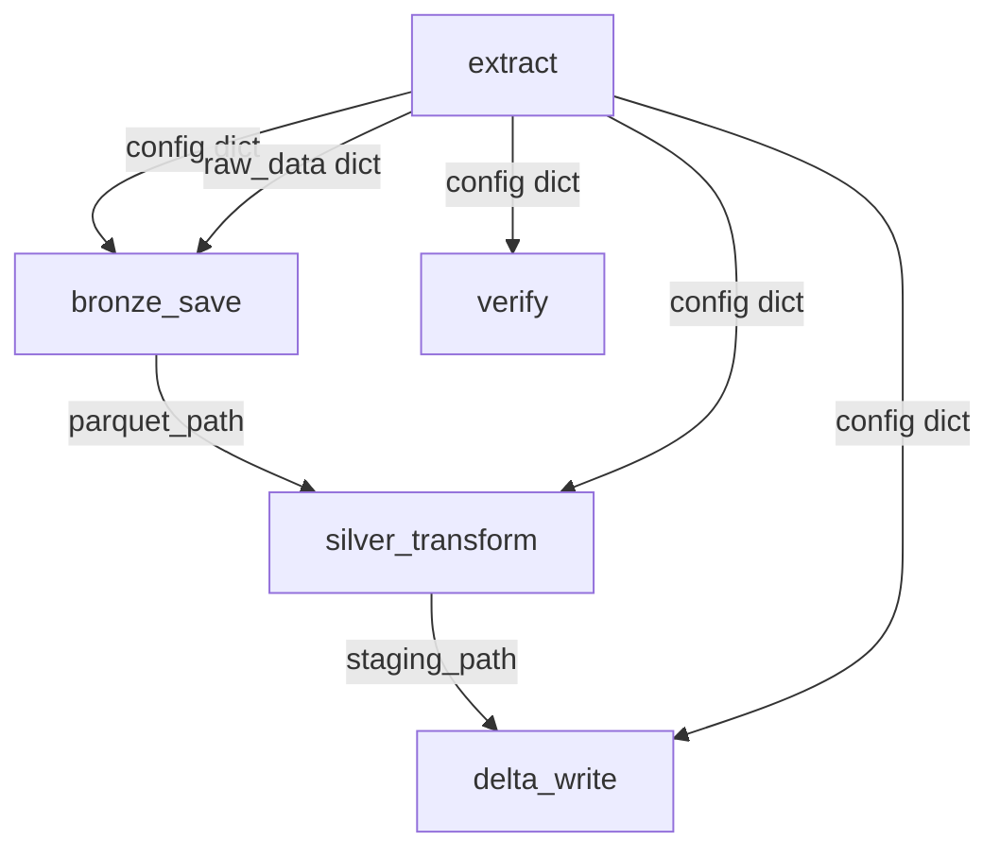

# LLM Benchmark Pipeline — DAG Orchestration

## Schedule

- **Cron**: `0 0 * * *` (daily at midnight UTC)
- **Catchup**: Disabled — only runs for the current date
- **Retries**: 2 per task, 5-minute delay between retries

## Task Flow

## Task Breakdown

| Task | Layer | Action | Retry Isolation |
|------|-------|--------|-----------------|
| `extract` | Bronze | Fetch LLM benchmark data from Artificial Analysis API | If this fails, nothing downstream runs |
| `bronze_save` | Bronze | Save raw JSON + flatten to Parquet | Retries without re-calling API |
| `silver_transform` | Silver | Read Parquet, deduplicate, cast types, nullify sentinels | Retries without re-extracting or re-saving |
| `delta_write` | Silver | Write cleaned DataFrame to Delta Lake table | Retries without re-transforming |
| `verify` | Silver | Validate Delta table row count, partitions, history | Retries without re-writing |

## Data Flow Between Tasks (XCom)

## Key Design Decisions

- **Granular tasks**: Each step is isolated so partial retries don't repeat expensive operations (API calls, Spark transforms)
- **Staging Parquet**: Spark DataFrames can't be serialized via XCom, so `silver_transform` writes a temp Parquet that `delta_write` reads back
- **Top-level imports**: All `src/` module imports are at the file top for clarity
- **LocalExecutor**: Single-node execution suitable for local/dev environments
